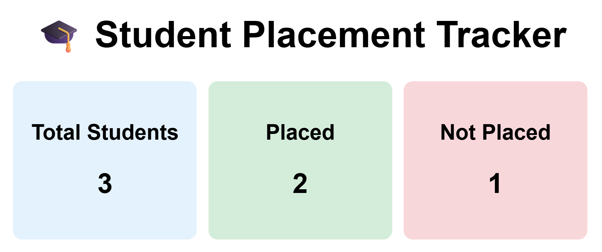
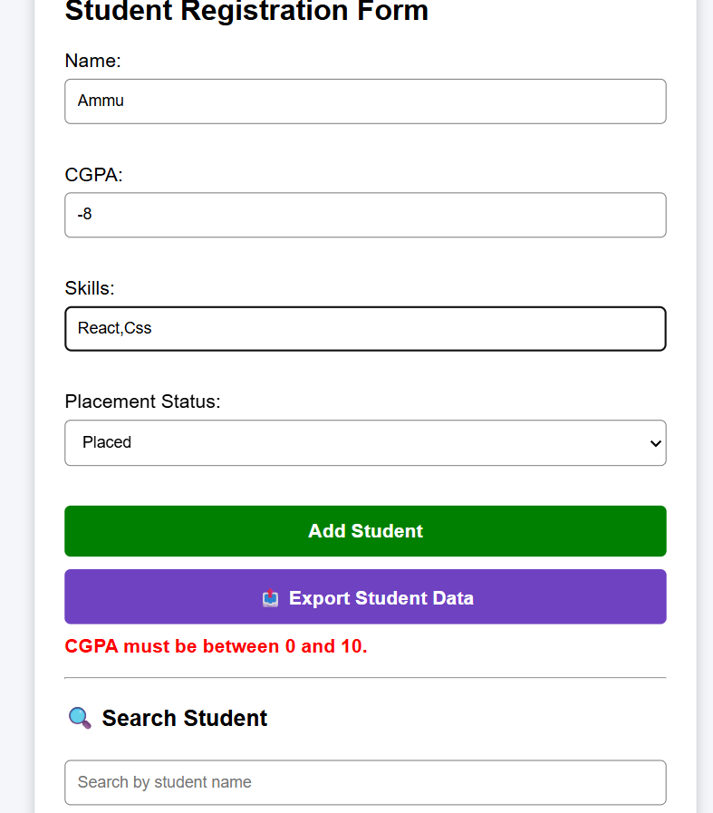
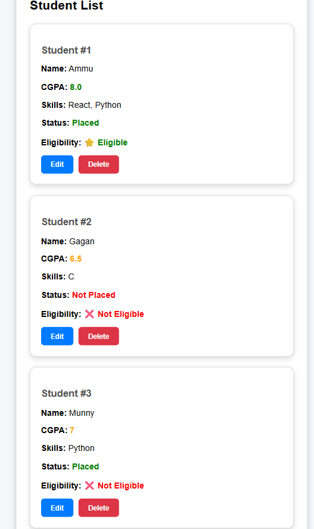

# 🎓 Student Placement Tracker

## 🎯 About the Project
A React-based CRUD web application designed to efficiently manage student placement records. The system allows users to add, edit, delete, search, and track students with details such as CGPA, skills, and placement status.

This project demonstrates strong frontend development skills, including component-based architecture, state management using React hooks, and real-time UI updates to deliver an interactive and responsive user experience.

## 🚀 Live Demo

**Live Website:** https://student-placement-tracker-ten.vercel.app

## 📂 GitHub Repository

**Repository:** https://github.com/AnushaPolagani/student-placement-tracker

---

## ✨ Features

* ➕ Add new student records
* ✏️ Edit existing student details
* 🗑️ Delete student records
* 🔍 Search students by name
* 💾 Data persistence using Local Storage
* 📊 Dashboard showing:

  * Total Students
  * Placed Students
  * Not Placed Students
* ⭐ Placement eligibility based on CGPA
* 📱 Clean and responsive user interface

---

## 🛠️ Technologies Used

* React.js
* JavaScript (ES6)
* HTML5
* CSS3
* Local Storage
* Git
* GitHub
* Vercel

---

## 📦 Installation

Clone the repository:

```bash
git clone https://github.com/AnushaPolagani/student-placement-tracker.git
```

Go to the project folder:

```bash
cd student-placement-tracker
```

Install dependencies:

```bash
npm install
```

Start the development server:

```bash
npm start
```

## 🚀 Local Setup

The application runs locally at:

http://localhost:3000
---

## 📸 Screenshots

### 📊 Dashboard View


### 📝 Add Student Form


### 📋 Student List View


---

## 👩‍💻 Developer

**Anusha Polagani**

GitHub: https://github.com/AnushaPolagani

---

## 📄 License

This project is built for learning and portfolio demonstration purposes.
